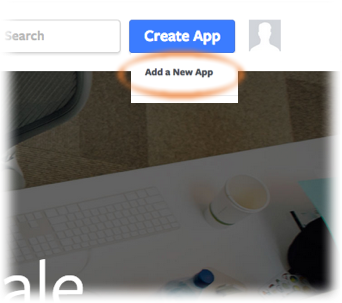
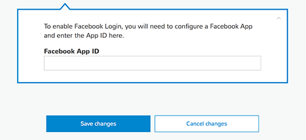

# Set Up Facebook Authentication

To use the following Facebook service configuration steps to federate Facebook as a user sign-in provider for AWS services called in your app, try the AWS Amplify [User Sign-in feature](./add-aws-mobile-user-sign-in).

You must first register your application with Facebook by using the [Facebook Developers portal](https://developers.facebook.com/).

AWS Amplify generates code that enables you to use Facebook to provide federated authentication for your mobile app users. This topic explains how to set up Facebook as an identity provider for your app.

If you already have a Facebook app ID, copy and paste it into the `Facebook App ID` field
when configuring authentication using the AWS Amplify CLI.

**To get a Facebook app ID**

1. In the [Facebook Developers portal](https://developers.facebook.com/), sign in with your
   Facebook credentials.

2. From `Create App`, choose `Add a New App` (note: this menu label will be
   `My Apps` if you have previously created an app.



3. If asked, choose the platform of your app that will use Facebook sign-in, and `basic
   setup`.

4. Type a display name for your app, select a category for your app from the `Category`
   drop-down list, and then choose `Create App ID`.


5. Complete the `Security Check` that appears. Your new app then appears in the
   `Dashboard`.


6. Copy the App ID and paste it into the `Facebook App ID` field in the Mobile Hub console.



7. In the Facebook Developer portal's left hand navigation list, choose `Settings`, then
   choose `+ Add Platform`.


8. Choose your platform and provide information about your app that Facebook will use for
   integration during credential validation.

   `For Android:`

      1. Provide your app's `Google Play Package Name`. (ie. `com.yourprojectname`).

      2. Provide your `Class Name` that handles deep links (ie.
        `com.yourprojectname.MainActivity`).


      3. Provide your app's Facebook development `Key Hashes`. This is a value that you
        generate via a terminal in your development environment, and is unique to that environment.

        To generate a development key for your Android environment on Mac, run the following command
        line.

        ```bash
            keytool -exportcert -alias androiddebugkey -keystore ~/.android/debug.keystore | openssl sha1 -binary | openssl base64
        ```

        To generate a development key for your Android environment on Windows, run the following
        command line.

        ```bash
            keytool -exportcert -alias androiddebugkey -keystore %HOMEPATH%\.android\debug.keystore | openssl sha1 -binary | openssl base64
        ```

        For more information, choose the `Quick Start` button in the upper left of the
        Facebook Developer Portal Add Platform dialog.

9. In the Facebook Developers portal, choose `Save changes`, then `Use this
   package name` if a dialog appears saying that Google Play has an issue with your package name.

10. Only users with roles assigned in the Facebook portal will be able to authenticate through your
   app while it is in development (not yet published).

    To authorize users, in the Facebook Developer portal's left hand navigation list, choose
    `Roles`, then `Add Testers`. Provide a valid Facebook ID.


11. In the Mobile Hub console, choose `Save changes`.

For more information about integrating with Facebook Login, see the [Facebook Getting Started Guide](https://developers.facebook.com/docs/facebook-login).
