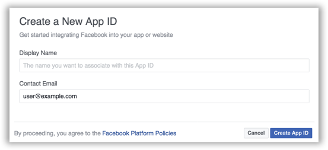
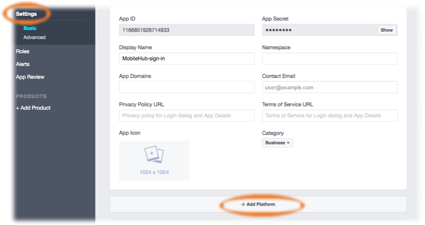
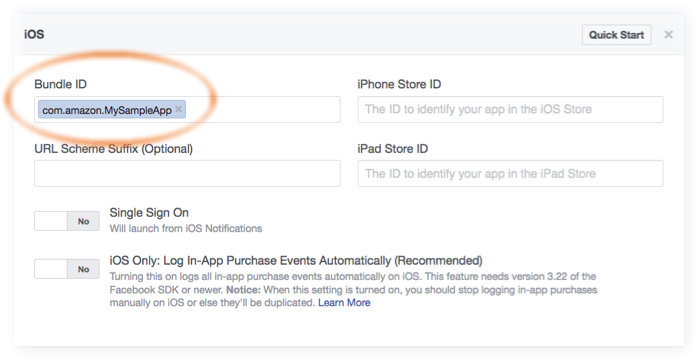

# Authentication

Enable your users to sign-in using credentials from Facebook, Google, or your own custom user directory. The CLI deploys [Amazon Cognito identity pool](https://docs.aws.amazon.com/cognito/latest/developerguide/cognito-identity.html) and [user pools](https://docs.aws.amazon.com/cognito/latest/developerguide/cognito-user-identity-pools.html) to create your backend.

## Customize the SDK Sign-In UI

By default, the SDK presents sign-in UI for each sign in provider you enable in your Mobile Hub project (Email and Password, Facebook, Google) with a default look and feel. It knows which provider(s) you chose by reading the `awsconfiguration.json` file you integrated with your app.

To override the defaults, and modify the behavior, look, and feel of the sign-in UI, create an `AuthUIConfiguration` object and set the appropriate properties.


iOS - Swift

Create and configure an `AWSAuthUIConfiguration` object and set its properties.

Create and configure an `AuthUIConfiguration` object.

* To present the Email and Password user `SignInUI`, set `enableUserPoolsUI` to `true`.

* To present Facebook or Google  user `SignInUI`, add `.addSignInButtonView(class: AWSFacebookSignInButton.self)` or `.addSignInButtonView(class: AWSFacebookSignInButton.self)`.

* To change the logo, use `logoImage`.

* To change the background color, use `backgroundColor`.

* To cancel the sign-in flow, use `canCancel`.

* To change the font in the sign-in views, use the `font` property and pass in the `UIFont` object that represents a font family.

* To draw the `backgroundColor` full screen, use `fullScreenBackgroundColor`.

```swift
import UIKit
import AWSAuthUI
import AWSMobileClient
import AWSUserPoolsSignIn
import AWSFacebookSignIn
import AWSGoogleSignIn

class SampleViewController: UIViewController {
    override func viewDidLoad() {
        super.viewDidLoad()
        if !AWSSignInManager.sharedInstance().isLoggedIn {
            presentAuthUIViewController()
        }
    }

    func presentAuthUIViewController() {
        let config = AWSAuthUIConfiguration()
        config.enableUserPoolsUI = true
        config.addSignInButtonView(class: AWSFacebookSignInButton.self)
        config.addSignInButtonView(class: AWSGoogleSignInButton.self)
        config.backgroundColor = UIColor.blue
        config.font = UIFont (name: "Helvetica Neue", size: 20)
        config.isBackgroundColorFullScreen = true
        config.canCancel = true

        AWSAuthUIViewController.presentViewController(
            with: self.navigationController!,
            configuration: config, completionHandler: { (provider: AWSSignInProvider, error: Error?) in
                if error == nil {
                    // SignIn succeeded.
                } else {
                    // end user faced error while loggin in, take any required action here.
                }
        })
    }
}
```

## Add User Sign-in to Your Mobile App with Amazon Cognito

### Set Up Your Backend

**Prerequisite** Complete the [Get Started](./get-started) steps before you proceed.

#### Email & Password

`This default auth configuration sets up a custom user pool for your app.`

**To set up email and password sign-in**

1. Navigate to your project folder (the folder that contains your app `.xcodeproj` file), and add the SDK to your app.
         ```bash
         $ cd ./YOUR_PROJECT_FOLDER
         $ amplify add auth
         ```

2. Choose the default configuration.

    ```
    ❯ Yes, use the default configuration.
    ```

3. When configuration for email and password sign-in is complete, a message appears confirming that you have configured local CLI metadata for this category. You can confirm this by viewing status.

    ```bash
    $ amplify status
      | Category | Resource name   | Operation | Provider plugin   |
      | -------- | --------------- | --------- | ----------------- |
      | Auth     | cognitoabcd0123 | Create    | awscloudformation |
    ```

4. To create your backend AWS resources run the following:

    ```bash
    $ amplify push
    ```

5. Follow the [Set up Email & Password Login](set-up-email-and-password) steps to connect to your backend from your app.

#### Facebook

**To set up Facebook sign-in**

1. In a terminal window, navigate to the root of your app files and add the auth category to your app. The CLI prompts you for configuration parameters.

    ```bash
    $ cd ./YOUR_PROJECT_FOLDER
    $ amplify add auth
    ```

2. Choose to set up your own configuration.

    ```
    ❯ No, I will set up my own configuration.
    ```

3. Choose to set up authentication flow using AWS IAM access controls.

    ```
    ❯ User Sign-Up, Sign-In, connected with AWS IAM controls
    ```

4. Choose yes, to: `? Allow unauthenticated logins?`.

5. Choose yes, to: `? Do you want to enable 3rd party authentication providers in your identity pool?`.

6. Choose Facebook and then provide your Facebook app ID. To retrieve or create your Facebook app ID, see [Setting Up Facebook Authentication](http://docs.aws.amazon.com/aws-mobile/latest/developerguide/auth-facebook-setup.html).

7. When configuration for Facebook sign-in is complete, the CLI displays a message confirming that you have configured local CLI metadata for this category. You can confirm this by viewing status.

    ```
    $ amplify status
    | Category  | Resource name   | Operation | Provider plugin   |
    | --------- | --------------- | --------- | ----------------- |
    | Auth      | cognitoa7cbb553 | Create    | awscloudformation |
    ```

8. To create your backend AWS resources run the following:

    ```
    $ amplify push
    ```

9. Follow the steps at [Set Up Facebook Login](./set-up-facebook) to connect to your backend from your app.

#### Google

**To set up Google sign-in**

1. In a terminal window, navigate to the root of your app files and add the auth category to your app. The CLI prompts you for configuration parameters.

	```
	$ cd ./YOUR_APP_ROOT
	$ amplify add auth
	```
2. Choose to set up your own configuration.

	```
	❯ No, I will set up my own configuration.
	```
3. Choose to set up authentication flow using AWS IAM access controls.

	```
	❯ User Sign-Up, Sign-In, connected with AWS IAM controls ...
	```

4. Choose yes, to: `? Allow unauthenticated logins?`.

5. Choose yes, to: `? Do you want to enable 3rd party authentication providers in your identity pool?`.

6. Choose Google and then provide your Google client ID. To retrieve or create your Google app ID, see [Setting Up Google Authentication](http://docs.aws.amazon.com/aws-mobile/latest/developerguide/auth-google-setup.html).

7. When configuration for Google sign-in is complete, the CLI displays a message confirming that you have configured local CLI metadata for this category. You can confirm this by viewing status.

	```
	$ amplify status
	| Category  | Resource name   | Operation | Provider plugin   |
	| --------- | --------------- | --------- | ----------------- |
	| Auth      | cognitoa7cbb553 | Create    | awscloudformation |
	```

8. To create your backend AWS resources run the following:

	```
	amplify push
	```

9. Follow the steps at [Set Up Google Login](./set-up-google) to connect to your backend from your app.

Note that the CLI allows you to select more than one identity provider for your app. You can also run `amplify auth update` to add an identity provider to an existing auth configuration.

### Set Up Email and Password Login in Your Mobile App

1. Add the following dependencies in your project's `Podfile`:

	```ruby
	platform :ios, '9.0'
	target :'YOUR-APP-NAME' do
	    use_frameworks!
	    pod 'AWSUserPoolsSignIn', '~> 2.6.13'
	    pod 'AWSAuthUI', '~> 2.6.13'
	    pod 'AWSMobileClient', '~> 2.6.13'
	    # other pods
	end
	```
2. Pull the SDK libraries into your local repo as follows:

	```bash
	pod install --repo-update
	```
### Set Up Facebook Login in Your Mobile App

1. Add or update your AWS backend configuration file to incorporate your new sign-in. For details, see the last steps in the [Get Started: Set Up Your Backend](./add-aws-mobile-sdk-basic-setup) section.

2. Add the following dependencies in your project's `Podfile`.

	```
	platform :ios, '9.0'
	  target :'YOUR-APP-NAME' do
	    use_frameworks!
	    pod 'AWSMobileClient', '~> 2.6.13'
	    pod 'AWSFacebookSignIn', '~> 2.6.13'
	    pod 'AWSUserPoolsSignIn', '~> 2.6.13'
	    pod 'AWSAuthUI', '~> 2.6.13'
	    # other pods
	  end
	```
	Run `pod install --repo-update`.

3. Add Facebook meta data to `Info.plist`.

	To configure your Xcode project to use Facebook Login, right-choose `Info.plist` and then choose `Open As > Source Code`.

	Add the following entry, using your project name, Facebook ID and login scheme ID.

	```xml
  <plist version="1.0">

  <dict>
  <!-- YOUR OTHER PLIST ENTRIES HERE -->

  <!-- START OF FACEBOOK PLIST ENTRIES HERE -->
  <!-- 0123456789012345 BELOW IS EQUIVALENT TO YOUR APP ID -->
  <key>FacebookAppID</key>
  <string>0123456789012345</string>
  <key>FacebookDisplayName</key>
  <string>YOUR-PROJECT-NAME</string>
  <key>LSApplicationQueriesSchemes</key>
  <array>
      <string>fbapi</string>
      <string>fb-messenger-api</string>
      <string>fbauth2</string>
      <string>fbshareextension</string>
  </array>
  <!-- END OF FACEBOOK PLIST ENTRIES HERE -->

  <!-- ADD AN ENTRY TO CFBundleURLTypes for Facebook -->
  <!-- IF YOU DO NOT HAVE CFBundleURLTypes, YOU CAN COPY THE WHOLE BLOCK BELOW -->
  <key>CFBundleURLTypes</key>
  <array>
      <dict>
          <key>CFBundleURLSchemes</key>
          <array>
              <string>fb0123456789012345</string>
          </array>
      </dict>
  </array>

  <!-- ... -->
  </dict>
	```

### Set Up Google Login in Your Mobile App

1. Add or update your AWS backend configuration file to incorporate your new sign-in. For details, see the last steps in the [Get Started: Set Up Your Backend](./start) section.

2. Add the following dependencies in the Podfile.

	```ruby
	platform :ios, '9.0'
	target :'YOUR-APP-NAME' do
	  use_frameworks!
	  pod 'AWSMobileClient', '~> 2.6.13'
	  pod 'AWSGoogleSignIn', '~> 2.6.13'
	  pod 'AWSUserPoolsSignIn', '~> 2.6.13'
	  pod 'AWSAuthUI', '~> 2.6.13'
	  pod 'GoogleSignIn', '~> 4.0'
	  # other pods
	end
	```
	Run `pod install --repo-update` before you continue.

3. Add Google metadata to `Info.plist`.

	To configure your Xcode project to use Google Login, open its `Info.plist` file using **Right-click > Open As > Source Code.** Add the following entry. Substitute your project name for the placeholder string.

	```xml

	<plist version="1.0">
	<!-- YOUR OTHER PLIST ENTRIES HERE -->

	<!-- ADD AN ENTRY TO CFBundleURLTypes for Google -->
	<!-- IF YOU DO NOT HAVE CFBundleURLTypes, YOU CAN COPY THE WHOLE BLOCK BELOW -->
	<key>CFBundleURLTypes</key>
	<array>
	    <dict>
	    <key>CFBundleURLSchemes</key>
	    <array>
	        <string>com.googleusercontent.apps.xxxxxxxxxxxx-xxxxxxxxxxxxxxxxxxxxxxxxxxxxxxxx</string>
	    </array>
	    </dict>
	</array>

	<!-- ... -->
	```

## Set Up Facebook Authentication

To use the following Facebook service configuration steps to federate Facebook as a user sign-in provider for AWS services called in your app, try the AWS Amplify [User Sign-in feature](./add-aws-mobile-user-sign-in).

You must first register your application with Facebook by using the [Facebook Developers portal](https://developers.facebook.com/).

AWS Amplify generates code that enables you to use Facebook to provide federated authentication for your mobile app users. This topic explains how to set up Facebook as an identity provider for your app.

If you already have a Facebook app ID, copy and paste it into the `Facebook App ID` field
when configuring authentication using the AWS Amplify CLI.

**To get a Facebook app ID**

1. In the [Facebook Developers portal](https://developers.facebook.com/), sign in with your
   Facebook credentials.

2. From `Create App`, choose `Add a New App` (note: this menu label will be
   `My Apps` if you have previously created an app.


3. If asked, choose the platform of your app that will use Facebook sign-in, and `basic
   setup`.

4. Type a display name for your app, select a category for your app from the `Category`
   drop-down list, and then choose `Create App ID`.




5. Complete the `Security Check` that appears. Your new app then appears in the
   `Dashboard`.


6. Copy the App ID and paste it into the `Facebook App ID` field in the Mobile Hub console.


7. In the Facebook Developer portal's left hand navigation list, choose `Settings`, then
   choose `+ Add Platform`.



8. Choose your platform and provide information about your app that Facebook will use for
   integration during credential validation.

   `For iOS:`

      1. Add your app's Bundle ID. (for example, com.amazon.YourProjectName).




9. In the Facebook Developers portal, choose `Save changes`, then `Use this
   package name` if a dialog appears saying that Google Play has an issue with your package name.

10. Only users with roles assigned in the Facebook portal will be able to authenticate through your
   app while it is in development (not yet published).

    To authorize users, in the Facebook Developer portal's left hand navigation list, choose
    `Roles`, then `Add Testers`. Provide a valid Facebook ID.


11. In the Mobile Hub console, choose `Save changes`.

For more information about integrating with Facebook Login, see the [Facebook Getting Started Guide](https://developers.facebook.com/docs/facebook-login).

## Set Up Google Authentication

To use the following Google service configuration steps to federate Google as a user sign-in provider for AWS services called in your app, try the AWS Amplify [User Sign-in feature](./add-aws-mobile-user-sign-in).

With AWS Amplify, you can configure a working Google Sign-In feature for both Android and iOS apps. To fully integrate Google Sign-In with your app, AWS Amplify needs information that comes from Google's setup process.

The following pages detail the Google Sign-In requirements ans steps to integrate Google Sign-In for both iOS and Android apps.

* `auth-google-create-google-project` (required for `all apps` regardless of platform)

* `auth-google-create-oauth-android-clientid` (required for all Android apps)

* `auth-google-create-oauth-ios-clientid` (required for all iOS apps)


## Add sign-in

1. Add code to create an instance of `AWSMobileClient` in the `application:open url` function  of your `AppDelegate.swift`, to resume a previously signed-in authenticated session.

	Then add another instance of `AWSMobileClient` in the `didFinishLaunching` function to register the sign in providers, and to fetch an Amazon Cognito credentials that AWS will use to authorize access once the user signs in.

	```swift
	 import UIKit
	 import AWSMobileClient

	 @UIApplicationMain

	 class AppDelegate: UIResponder, UIApplicationDelegate {

	     // Add an AWSMobileClient call in application:open url
	     func application(_ application: UIApplication, open url: URL,
	         sourceApplication: String?, annotation: Any) -> Bool {

	         return AWSMobileClient.sharedInstance().interceptApplication(
	             application, open: url,
	             sourceApplication: sourceApplication,
	             annotation: annotation)

	     }

	     // Add an AWSMobileClient call in application:didFinishLaunching
	     func application(
	         _ application: UIApplication,
	             didFinishLaunchingWithOptions launchOptions:
	                 [UIApplicationLaunchOptionsKey: Any]?) -> Bool {

	          return AWSMobileClient.sharedInstance().interceptApplication(
	              application, didFinishLaunchingWithOptions:
	              launchOptions)
	     }

	     // Other functions in AppDelegate . . .

	   }
	```

2. Make sure you have a `UINavigationController` in your app to use the sign-in UI. The sign-in UI uses the `UINavigationController` as an anchor to perform all the transitions. Learn more about using [UINavigationController](https://medium.com/whoknows-swift/swift-the-hierarchy-of-uinavigationcontroller-programmatically-91631990f495).

3. Implement your sign-in UI by calling the library provided by the SDK.

	```swift
	import UIKit
	import AWSAuthCore
	import AWSAuthUI

	class SampleViewController: UIViewController {

	 override func viewDidLoad() {

	     super.viewDidLoad()

	     // Call the showSignIn method from your `viewDidLoad` method
	     // The showSignIn() method will check if the user is logged in,
	     // and if the user is not logged in, it will present a sign-in UI using the navigation controller the view is part of.
	     showSignIn()
	 }

	 func showSignIn() {
	     if !AWSSignInManager.sharedInstance().isLoggedIn {
	        AWSAuthUIViewController
	          .presentViewController(with: self.navigationController!,
	               configuration: nil,
	               completionHandler: { (provider: AWSSignInProvider, error: Error?) in
	                  if error != nil {
	                      print("Error occurred: \(String(describing: error))")
	                  } else {
	                      // Sign in successful.
	                  }
	               })
	     }
	 }
	}
	```

	Choose the run icon (|play|) in the top left of the Xcode window or type Cmd+R to build and run your app. You should see our pre-built sign-in UI for your app. Checkout the next steps to learn how to :ref:`customize your UI <add-aws-mobile-user-sign-in-customize>`.

 * API References
    * [AWSMobileClient](https://docs.aws.amazon.com/AWSiOSSDK/latest/Classes/AWSMobileClient.html)
       `A library that initializes the SDK, fetches the AWS credentials, and creates a SDK SignInUI client instance.`
    * [Auth UserPools](https://docs.aws.amazon.com/AWSiOSSDK/latest/Classes/AWSUserPoolsUIOperations.html)
       `A wrapper Library for Amazon Cognito UserPools that provides a managed Email/Password sign-in UI.`
    * [Auth Core](https://docs.aws.amazon.com/AWSiOSSDK/latest/Classes/AWSIdentityManager.html)
       `A library that caches and federates a login provider authentication token using Amazon Cognito Federated Identities, caches the federated AWS credentials, and handles the sign-in flow.`

## Add sign-out

Sign-out code example. This call should be invoked on a UI activity like a button press triggered by the end user. E.g. `onSignOutButtonClicked` action of sign out button in your app.

	```swift
	AWSSignInManager.sharedInstance().logout(completionHandler: {(result: Any?, error: Error?) in
		// Note: The showSignIn() method used below was added by us previously while integrating the sign-in UI.
		self.showSignIn()
	})
	```

For a fuller example, see [Sign-out a Signed-in User](how-to-user-sign-in-sign-out) in the How To section.

### Next Steps

  * [Customize the UI](./add-aws-mobile-user-sign-in-customize)
  * [Import Your Existing Amazon Cognito Identity Pool](./how-to-cognito-integrate-an-existing-identity-pool)
  * [Amazon Cognito Developer Guide](http://docs.aws.amazon.com/cognito/latest/developerguide/)
